```markdown
# Warroom Agent: Design Document

## 1. Introduction

The Warroom Agent is a multi-agent system designed to automate and assist Site Reliability Engineering (SRE) teams during incident response. By leveraging a team of specialized AI agents, it aims to reduce mean time to resolution (MTTR), automate repetitive diagnostic tasks, and provide real-time updates and comprehensive post-mortems.

This system is built on LangGraph, enabling a flexible and stateful workflow where agents can collaborate, delegate tasks, and loop through investigation cycles until an incident is resolved.

## 2. System Architecture

The Warroom Agent operates as a cohesive unit of four distinct roles, orchestrated by the Strategist. The workflow is triggered by an incoming alert and proceeds through stages of analysis, investigation, and reporting, with continuous logging throughout the process.

### 2.1. Mermaid Architecture Diagram

```mermaid
graph TD
    subgraph External Systems
        A[Cloud Alerts <br> Huawei Cloud/AWS/K8s]
        C[Communication <br> Slack/Discord]
        D[Historical Incidents DB <br> Vector Store]
        E[Live Infrastructure <br> Cloud APIs, kubectl]
    end

    subgraph Warroom Agent
        S[Sentinel]
        ST[Strategist]
        I[Investigator]
        H[Historian]
    end

    A --> S
    S -- Triage & Normalize Alert --> ST
    ST -- Search Past Incidents --> D
    D -- Relevant Incidents --> ST
    ST -- Formulate Plan --> I
    I -- Execute Diagnostics --> E
    E -- Diagnostic Data --> I
    I -- Analysis & Findings --> ST
    ST -- Updates & Tasking --> C
    C -- Human Input --> ST
    ST -- Log Event --> H
    I -- Log Actions --> H
    S -- Log Alert --> H
    H -- Generates Post-Mortem --> ST
```



## 3. Agent Roles & Responsibilities

The system is composed of four specialized agents. Each agent has a unique role and a set of tools to perform its tasks.

### 3.1. Sentinel

The Sentinel is the first line of defense, responsible for monitoring and initial alert processing.

-   **Role**: Monitor & Triage
-   **Responsibilities**:
    -   Ingest alerts from various monitoring systems (Huawei Cloud, AWS CloudWatch, Kubernetes events, Prometheus, etc.).
    -   Normalize alerts from different sources into a standardized JSON format.
    -   Perform initial triage: filter out noise, de-duplicate alerts, and assess preliminary severity.
    -   Enrich alerts with basic metadata, such as affected service and cloud environment.
-   **Integrations**:
    -   AWS SNS/EventBridge
    -   Huawei Cloud SMN (Simple Message Notification)
    -   Kubernetes API Server (for events)
-   **Output**: A structured `Incident` object passed to the Strategist.

### 3.2. Strategist

The Strategist is the central orchestrator of the incident response process. It maintains the state of the incident and coordinates the actions of other agents and human responders.

-   **Role**: Orchestrator & Communicator
-   **Responsibilities**:
    -   Receive the `Incident` object from the Sentinel.
    -   Query the **Historian**'s knowledge base (RAG) for similar past incidents to find potential root causes and resolution steps.
    -   Develop an initial investigation plan based on the alert and historical data.
    -   Delegate diagnostic tasks to the **Investigator** agent.
    -   Serve as the primary interface to human responders via Slack or Discord, providing real-time updates, asking for decisions, and assigning tasks.
    -   Continuously reassess the situation based on new findings from the Investigator and update the plan.
    -   Declare the incident resolved and trigger the post-mortem generation by the Historian.
-   **Integrations**:
    -   LangGraph state management.
    -   Slack/Discord APIs.
    -   Vector database for RAG.
-   **Core Logic**: Uses a ReAct (Reason + Act) framework to decide the next step, which could be querying the RAG, dispatching an Investigator, or notifying humans.

### 3.3. Investigator

The Investigator is the hands-on diagnostic agent, equipped with tools to probe live infrastructure and analyze data.

-   **Role**: Diagnostics & Root Cause Analysis
-   **Responsibilities**:
    -   Execute diagnostic commands and API calls as directed by the Strategist.
    -   Analyze logs, metrics, and traces from observability platforms.
    -   Perform root cause analysis by correlating events and identifying anomalies.
    -   Examples of tasks:
        -   `kubectl get pods -n <namespace> -o wide` to check pod status.
        -   `kubectl logs <pod-name>` to fetch application logs.
        -   Check AWS EC2 instance health or Lambda function error rates.
        -   Query a time-series database for performance metrics.
-   **Tools**:
    -   `kubectl` CLI wrapper.
    -   AWS SDK (Boto3) wrapper.
    -   Huawei Cloud SDK wrapper.
    -   APM/Observability tool clients (e.g., Datadog, Grafana).
-   **Output**: Structured diagnostic findings and analysis reports sent back to the Strategist.

### 3.4. Historian

The Historian is responsible for memory and learning. It logs all activities during an incident and leverages this data for future use.

-   **Role**: Logger & Chronicler
-   **Responsibilities**:
    -   Maintain a real-time, append-only log of every action taken by any agent and every decision made.
    -   Store incident data (alerts, investigation findings, resolution steps) in a long-term vector store upon incident resolution. This data powers the RAG capabilities of the Strategist.
    -   Generate a comprehensive post-mortem report once the Strategist declares the incident resolved. The report includes:
        -   A timeline of events.
        -   The root cause identified.
        -   The actions taken for resolution.
        -   Key metrics (e.g., time to detection, time to resolution).
-   **Integrations**:
    -   Vector Database (e.g., Pinecone, ChromaDB) for storing incident embeddings.
    -   Document generation library (e.g., Markdown, PDF).
-   **Output**: A Markdown-formatted post-mortem document.

## 4. Integration Strategies

### 4.1. Cloud & Kubernetes Integration

-   **Authentication**: The agent will use standard, secure authentication mechanisms for each platform. This includes IAM Roles for AWS, IAM for Huawei Cloud, and Service Accounts for Kubernetes. Credentials will be managed via a secure secret store (e.g., HashiCorp Vault, AWS Secrets Manager).
-   **Tooling**: The Investigator agent will use official SDKs (Boto3 for Python, Huawei Cloud SDKs) and the `kubernetes` Python client library. These will be exposed as sandboxed tools that the agent can invoke with specific parameters.

### 4.2. Communication Integration (Slack/Discord)

-   **Bots**: A dedicated bot user for Slack or Discord will be created.
-   **APIs**: The Strategist will use the Slack/Discord Events API to receive messages from humans (e.g., manual incident escalations or commands) and the Web API to send messages to channels.
-   **Interactivity**: Slack's Block Kit will be used to create rich, interactive messages with buttons for decision-making (e.g., "Acknowledge", "Escalate", "Approve Action").

### 4.3. RAG and Historical Data

-   **Vectorization**: After an incident, the Historian will create a document summarizing the incident (alert details, root cause, resolution steps) and use a sentence-transformer model to create embeddings.
-   **Storage**: These embeddings and the corresponding text will be stored in a vector database.
-   **Retrieval**: When a new incident occurs, the Strategist will embed the incoming alert and query the vector database to find the top-k most similar past incidents, providing immediate context and potential solutions.
```
